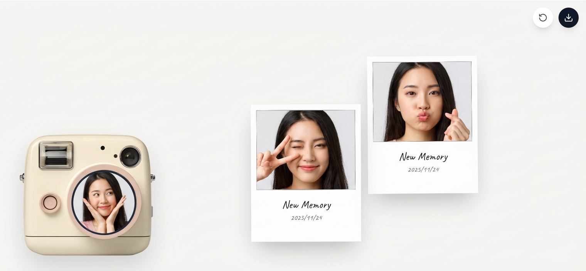

# Retro Camera - AI驱动的拍立得相机应用

## 语言版本
- [English README](README.md)
- [中文 README](README-zh.md)


<div align="center">
<!-- 产品截图占位符 -->

</div>

## 项目概述
这是一个复古风格的相机Web应用，使用AI技术生成拍立得风格的照片。该应用具有直观的相机界面，包括取景器、快门按钮和AI图像生成功能。

## 灵感来源
这个项目的想法源自这个Twitter帖子：
https://x.com/ann_nnng/status/1991079810882265254

## AI生成详情
### 提示来源
生成此项目的主要提示是从以下内容总结而来：
https://cloud.typingmind.com/share/f4d4bf7e-3898-4b64-b1ec-0d480258e722

### 使用的模型
这个项目是使用 **Gemini 3 Pro Preview** 创建的（截至2025年11月24日，最新可用版本）。该模型在生成前端UI代码方面表现出色，展示了其在创建视觉吸引力和功能齐全的Web应用方面的能力。

### 手动调整
拍摄计划和相机位置功能无法由Gemini 3 Pro模型准确生成。这些位置是手动调整的，以实现精确的功能。

## 主要功能
- **拍立得风格**：照片采用经典拍立得美学和动画效果
- **拖拽功能**：拍立得照片可以在屏幕上自由移动
- **画廊视图**：照片以画廊格式显示
- **批量下载**：照片可以作为合成图像下载
- **演示模式**：使用示例照片初始化，可立即预览
- **音频反馈**：拍照时播放逼真的快门声音

## 本地运行

**前提条件：** Node.js

1. 安装依赖：
   `npm install`
2. 运行应用：
   `npm run dev`

## 未来功能想法
这个项目可以扩展很多有趣的功能：
- 多连拍模式
- 贴纸和照片编辑工具
- 滤镜和效果
- 分享到社交媒体
- 相机设置（曝光、对焦等）

## AI在开发中的力量
这个项目展示了AI在前端开发中的巨大潜力。只需一个精心设计的提示，Gemini 3 Pro就能生成应用的大部分功能。人工干预很少，仅限于微调特定位置。这展示了AI如何在保持高质量结果的同时加速开发过程。

## 提示词
```md
# 拍立得相机Web应用开发需求提示词
请使用HTML、CSS、JavaScript结合交互式canvas插件，开发一款名为“Retro Camera”的拍立得相机Web应用，具体需求如下：

## 一、核心基础配置
1. 相机资源：使用指定相机图片（https://www.bubbbly.com/assets/retro-camera.webp），调整镜头位置（匹配图片上的黑色圆圈，需上移且稍偏右），镜头位置上显示的是实时的摄像头画面，同步调整相机按钮位置以适配图片；相机整体左移（右侧预留空白区域，供拖拽图片存放），且整体下移（上方预留空间，供图片升起展示）。
2. 响应式要求：适配移动设备，所有元素布局在手机端正常显示。

## 二、初始演示效果
1. 用户未拍照前，显示3张指定demo图（https://bubbbly.com/assets/retro-camera/cat-cute-3.webp、https://bubbbly.com/assets/retro-camera/cat-cute-2.webp、https://bubbbly.com/assets/retro-camera/cat-cute-1.webp）；
2. demo图需稍放大，且排列紧密；用户开始拍照后，自动清除所有demo图。

## 三、拍照与图片生成功能
1. 拍照触发：点击相机按钮即可拍照，一次仅能拍摄一张；拍照要调用摄像头的API
2. 音效反馈：拍照时自动播放指定音效（https://www.bubbbly.com/assets/retro-camera/polaroid-camera.mp3）；
3. 图片效果：生成的图片需带拍立得样式+复古滤镜，图片高度缩小，从相机顶部弹出（上升动画），仅显示1/2高度，一次仅显示一张升起的图片；

## 四、图片编辑与拖拽功能
1.  caption设置：图片默认显示两行文字——第一行“May I meet you”（字号稍大），第二行当天日期（格式YYYY/MM/DD，同字体家族，字号更小）；用户可直接在图片上编辑该caption；
2. 拖拽功能：拍立得图片支持拖拽（参考https://css-tricks.com/books/greatest-css-tricks/draggable-elements/），可拖拽到相机右侧空白区域存放。

## 五、功能按钮
1. 重置按钮：点击可清除所有用户拍摄的图片；
2. 下载按钮：点击可一次性下载所有拍立得图片（合并为单帧文件）。

## 六、引导提示
用户拍摄第一张图片时，显示分步工具提示（tooltip）：①点击按钮拍照 ②拖拽到那里保存。
```